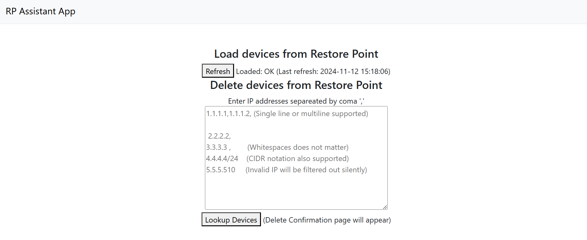

# RP Assistant

> Simple web application which help with deletion of devices in bulk from Restore Point.

## Table of Contents

- [Introduction](#introduction)
- [Features](#features)
- [Tech Stack](#tech-stack)
- [Installation](#installation)
- [Environment Setup](#environment-setup)
- [Running the Application](#running-the-application)
- [License](#license)

---

## Introduction

Simple web application which help with deletion of devices in bulk from Restore Point. Restore Point device seatch is limited and does not allow regex filtering. Deletion of large
number of devices is not convenient.



## Features

- Authentication with token
- Delete multiple devices based on IP addresses
- Confirmation with additional details before deletion

## Tech Stack

- **Framework**: Flask
- **Database**: JSON file
- **Languages**: Python, JavaScript , HTML, CSS
- **Additional Libraries**: requests, ipaddress

## Installation

1. **Clone the repository:**
   ```
   git clone https://github.com/bulkos1st/rp_assistant.git
   cd rp_assistant
   ```

2. **Create a virtual environment:**
    ```
    python3 -m venv venv
    source venv/bin/activate  # On Windows, use `venv\Scripts\activate`
    ```

3. **Install the dependencies:**
    ```
    pip install -r requirements.txt
    ```

## Environment Setup

1. **Create a .env file in the project root with the following configuration:**
   ```
   RP_TOKEN=your_token_here
   RP_URL=url_here (https://xxxx)
   SECRET_KEY=your_secret_key_here (used to signin session cookies)
   ```

## Running the Application

1. **Start the Flask development server**
   ```
    flask run
   ```

## License

This project is licensed under the MIT License.